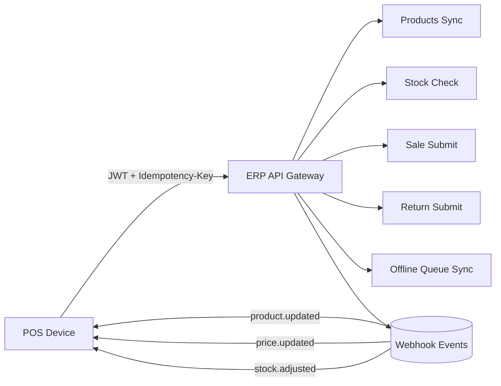
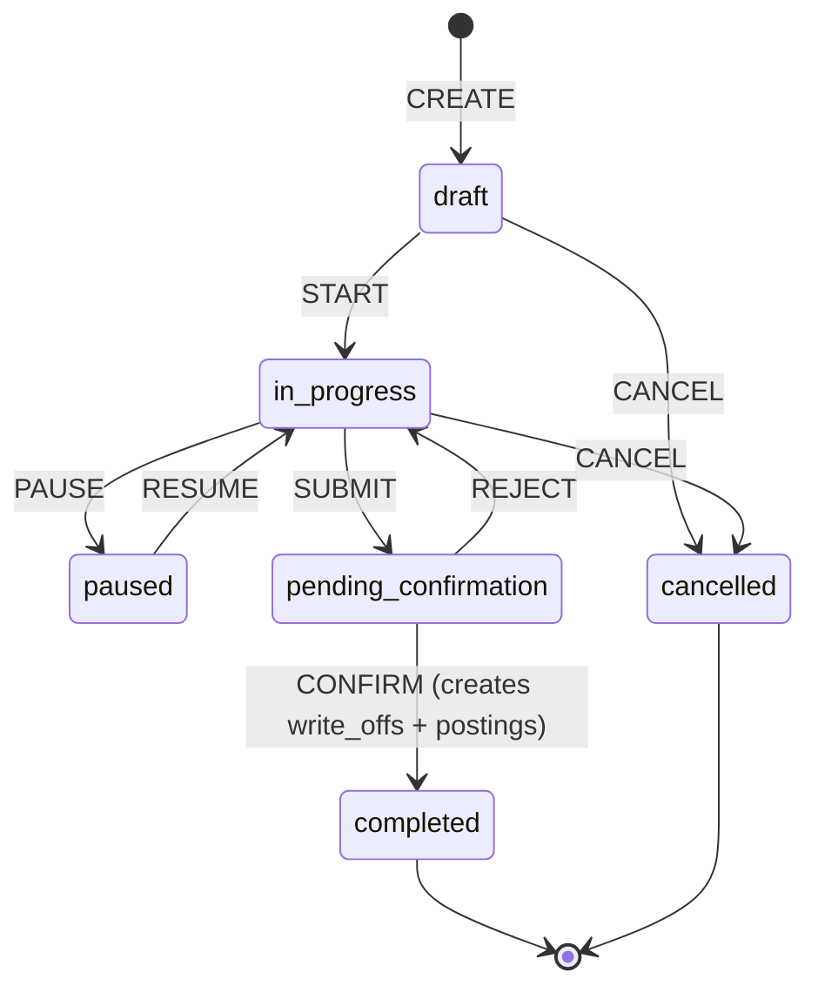
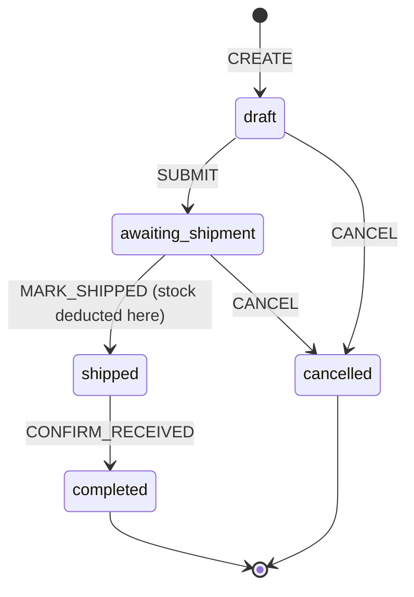
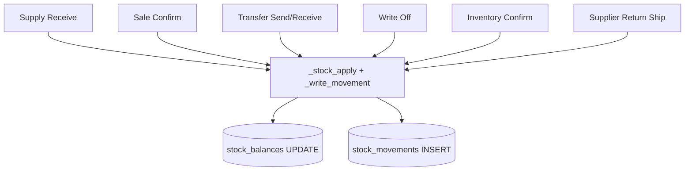
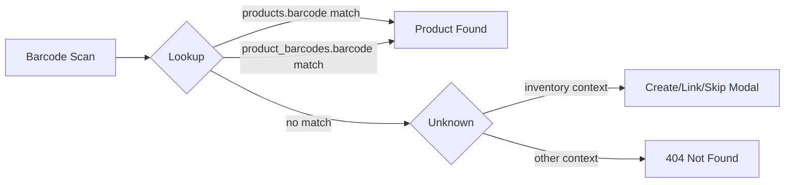
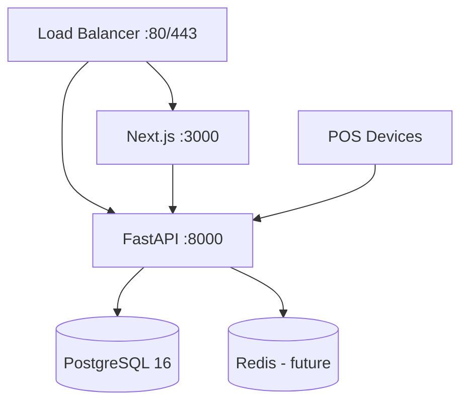

# Target Architecture — Aniq ERP Inventory (TZ to'liq bajarilgan holat)

> Yaratilgan: 2026-09-05
> Sprint 5-7 tugagandan keyingi maqsad holat

---

## 1. Yangi jadvallar (Sprint 5-7 da qo'shiladi)

### 1.1 `stock_movements` — TZ-07 immutable journal

```sql
CREATE TABLE IF NOT EXISTS stock_movements (
    id              BIGSERIAL PRIMARY KEY,
    organization_id UUID        NOT NULL REFERENCES organizations(id) ON DELETE CASCADE,
    warehouse_id    INT         NOT NULL REFERENCES warehouses(id),
    product_id      UUID        NOT NULL REFERENCES products(id),
    operation_type  VARCHAR(30) NOT NULL,
    -- 'purchase_in', 'sale_out', 'sale_return_in', 'supplier_return_out',
    -- 'transfer_in', 'transfer_out', 'write_off_out', 'posting_in',
    -- 'inventory_adjust_in', 'inventory_adjust_out', 'correction'
    before_qty      NUMERIC(20,3) NOT NULL,
    change_qty      NUMERIC(20,3) NOT NULL,
    after_qty       NUMERIC(20,3) NOT NULL,
    unit_cost       NUMERIC(20,4),
    document_type   VARCHAR(30),
    -- 'supply', 'sale', 'sale_return', 'supplier_return',
    -- 'internal_transfer', 'write_off', 'inventory'
    document_id     UUID,
    document_number VARCHAR(50),
    user_id         UUID REFERENCES users(id),
    notes           TEXT,
    external_id     VARCHAR(100),  -- idempotency key yoki POS transaction ID
    created_at      TIMESTAMPTZ NOT NULL DEFAULT NOW()
);

CREATE INDEX IF NOT EXISTS idx_stock_mov_org_wh ON stock_movements(organization_id, warehouse_id, created_at DESC);
CREATE INDEX IF NOT EXISTS idx_stock_mov_product ON stock_movements(organization_id, product_id, created_at DESC);
CREATE INDEX IF NOT EXISTS idx_stock_mov_doc ON stock_movements(document_type, document_id);
CREATE INDEX IF NOT EXISTS idx_stock_mov_external ON stock_movements(external_id) WHERE external_id IS NOT NULL;
```

### 1.2 `product_barcodes` — kengaytirish (TZ-04)

Mavjud jadvalga qo'shiladigan ustunlar:
```sql
ALTER TABLE product_barcodes ADD COLUMN IF NOT EXISTS is_primary BOOLEAN DEFAULT FALSE;
ALTER TABLE product_barcodes ADD COLUMN IF NOT EXISTS is_active BOOLEAN DEFAULT TRUE;
ALTER TABLE product_barcodes ADD COLUMN IF NOT EXISTS added_by UUID REFERENCES users(id);
ALTER TABLE product_barcodes ADD COLUMN IF NOT EXISTS added_at TIMESTAMPTZ DEFAULT NOW();
ALTER TABLE product_barcodes ADD COLUMN IF NOT EXISTS deactivated_by UUID REFERENCES users(id);
ALTER TABLE product_barcodes ADD COLUMN IF NOT EXISTS deactivated_at TIMESTAMPTZ;

-- Tizim darajasida faol barcode yagonaligi
CREATE UNIQUE INDEX IF NOT EXISTS uq_product_barcodes_active
  ON product_barcodes(barcode) WHERE is_active = TRUE;
```

### 1.3 `supplier_returns` / `supplier_return_items` — TZ-10

```sql
CREATE TABLE IF NOT EXISTS supplier_returns (
    id                  UUID PRIMARY KEY DEFAULT gen_random_uuid(),
    organization_id     UUID NOT NULL REFERENCES organizations(id) ON DELETE CASCADE,
    doc_number          VARCHAR(50),
    supplier_id         UUID NOT NULL REFERENCES suppliers(id),
    warehouse_id        INT  NOT NULL REFERENCES warehouses(id),
    supply_id           UUID REFERENCES supplies(id),  -- manba zakupka (optional)
    return_date         DATE NOT NULL,
    reason              VARCHAR(50) NOT NULL,
    -- 'defect','expired','wrong_delivery','damaged','quality_issue','excess','custom'
    compensation_type   VARCHAR(30) NOT NULL,
    -- 'refund','replacement','offset'
    status              VARCHAR(30) NOT NULL DEFAULT 'draft',
    -- 'draft','awaiting_shipment','shipped','completed','cancelled'
    notes               TEXT,
    total_amount        NUMERIC(20,2) DEFAULT 0,
    created_by          UUID REFERENCES users(id),
    created_at          TIMESTAMPTZ DEFAULT NOW()
);

CREATE TABLE IF NOT EXISTS supplier_return_items (
    id                  BIGSERIAL PRIMARY KEY,
    return_id           UUID NOT NULL REFERENCES supplier_returns(id) ON DELETE CASCADE,
    product_id          UUID NOT NULL REFERENCES products(id),
    supply_item_id      BIGINT REFERENCES supply_items(id),
    quantity            NUMERIC(20,3) NOT NULL,
    unit_cost           NUMERIC(20,4) NOT NULL,
    amount              NUMERIC(20,2) GENERATED ALWAYS AS (quantity * unit_cost) STORED,
    notes               TEXT
);
```

### 1.4 `inventory_scan_events` — TZ-12 parallel scan

```sql
ALTER TABLE inventories ADD COLUMN IF NOT EXISTS is_blind BOOLEAN DEFAULT FALSE;
ALTER TABLE inventories ADD COLUMN IF NOT EXISTS lock_mode VARCHAR(20) DEFAULT 'none';
-- 'none' | 'partial' (only selected categories) | 'full'

ALTER TABLE inventory_items ADD COLUMN IF NOT EXISTS scanned_by UUID REFERENCES users(id);
ALTER TABLE inventory_items ADD COLUMN IF NOT EXISTS scanned_at TIMESTAMPTZ;
ALTER TABLE inventory_items ADD COLUMN IF NOT EXISTS version INT NOT NULL DEFAULT 1;

CREATE TABLE IF NOT EXISTS inventory_scan_events (
    id              BIGSERIAL PRIMARY KEY,
    inventory_id    UUID NOT NULL REFERENCES inventories(id) ON DELETE CASCADE,
    item_id         BIGINT REFERENCES inventory_items(id),
    product_id      UUID NOT NULL REFERENCES products(id),
    delta_qty       NUMERIC(20,3) NOT NULL,
    scanned_by      UUID REFERENCES users(id),
    created_at      TIMESTAMPTZ DEFAULT NOW()
);
CREATE INDEX IF NOT EXISTS idx_scan_events_inv ON inventory_scan_events(inventory_id, created_at);
```

### 1.5 Holat enum kengaytirish — TZ-12

```sql
-- inventory_status enum kengaytirish (PostgreSQL ADD VALUE IF NOT EXISTS — idempotent)
ALTER TYPE inventory_status ADD VALUE IF NOT EXISTS 'paused';
ALTER TYPE inventory_status ADD VALUE IF NOT EXISTS 'pending_confirmation';
```

### 1.6 supply_items qisman qabul — TZ-06

```sql
ALTER TABLE supply_items ADD COLUMN IF NOT EXISTS received_qty NUMERIC(20,3);
ALTER TABLE supplies ADD COLUMN IF NOT EXISTS payment_status VARCHAR(20) DEFAULT 'unpaid';
```

### 1.7 sale_items COGS — TZ-15

```sql
ALTER TABLE sale_items ADD COLUMN IF NOT EXISTS cost NUMERIC(20,4) DEFAULT 0;
```

### 1.8 cashboxes warehouse binding — TZ-02

```sql
ALTER TABLE cashboxes ADD COLUMN IF NOT EXISTS warehouse_id INT REFERENCES warehouses(id);
```

---

## 2. `_stock_apply` kengaytirish — markaziy yozuv mexanizmi

Hozirgi `_stock_apply(db, warehouse_id, product_id, delta_qty, cost, allow_negative)` funksiyasi
`stock_balances`ni UPDATE qiladi. Kelajakda u qo'shimcha ravishda `stock_movements`ga INSERT ham qiladi:

```
_stock_apply(
  db, warehouse_id, product_id, delta_qty,
  cost=None, allow_negative=False,
  operation_type=None, document_type=None, document_id=None,
  user_id=None, external_id=None
) -> movement_id
```

Har operatsiya turi:
- `purchase_in` — `_stock_apply` supply receive paytida
- `sale_out` — `_stock_apply` sale confirm paytida
- `transfer_out` / `transfer_in` — ikki chaqiruv, bir transaktsiya
- `write_off_out` / `posting_in` — write_off document'dan
- `inventory_adjust_in/out` — inventory finish paytida

---

## 3. Yangi endpointlar (Sprint 5-7)

### 3.1 Stock Movements (TZ-07)
```
GET  /api/v1/warehouse/movements         — filtrlangan harakat jurnali
GET  /api/v1/warehouse/movements/{id}    — bitta yozuv + document link
```

### 3.2 Product Barcodes (TZ-04)
```
GET    /api/v1/warehouse/products/{id}/barcodes
POST   /api/v1/warehouse/products/{id}/barcodes
PATCH  /api/v1/warehouse/products/{id}/barcodes/{barcode_id}
DELETE /api/v1/warehouse/products/{id}/barcodes/{barcode_id}/deactivate
POST   /api/v1/warehouse/products/{id}/barcodes/{barcode_id}/set-primary
GET    /api/v1/warehouse/barcode-lookup?q={barcode}
```

### 3.3 Supplier Returns (TZ-10)
```
GET    /api/v1/warehouse/supplier-returns
POST   /api/v1/warehouse/supplier-returns
GET    /api/v1/warehouse/supplier-returns/{id}
PATCH  /api/v1/warehouse/supplier-returns/{id}
POST   /api/v1/warehouse/supplier-returns/{id}/submit
POST   /api/v1/warehouse/supplier-returns/{id}/complete
POST   /api/v1/warehouse/supplier-returns/{id}/cancel
```

### 3.4 Inventory Rich States (TZ-12)
```
POST /api/v1/warehouse/inventories/{id}/pause
POST /api/v1/warehouse/inventories/{id}/resume
POST /api/v1/warehouse/inventories/{id}/submit-for-confirmation
POST /api/v1/warehouse/inventories/{id}/confirm
POST /api/v1/warehouse/inventories/{id}/scan      — barcode event
GET  /api/v1/warehouse/inventories/{id}/progress  — parallel workers uchun
```

### 3.5 Reorder List (TZ-11)
```
GET  /api/v1/warehouse/reorder-list
POST /api/v1/warehouse/reorder-list/create-draft-po
```

### 3.6 Reports (TZ-14, TZ-15)
```
GET /api/v1/statistics/stock-movements-report
GET /api/v1/statistics/inventory-report/{inventory_id}
GET /api/v1/statistics/cogs-report
GET /api/v1/statistics/supplier-report
```

---

## 4. POS-ERP integratsiya nuqtalari



---

## 5. Multi-tenant + Concurrency patternlari

### 5.1 Optimistic Locking — Inventory parallel scan

```
Given: 2 ta xodim bir vaqtda inventory_items.actual_qty ni o'zgartiradi
When: UPDATE inventory_items SET actual_qty=:new, version=version+1 WHERE id=:id AND version=:expected
Then: Birinchi UPDATE natija qaytaradi, ikkinchi 0 row updated → 409 Conflict qaytariladi
```

### 5.2 Idempotency — POS offline queue

```
Header: Idempotency-Key: <uuid>
Server:
  1. stock_movements.external_id = Idempotency-Key tekshiriladi
  2. Topilsa: 200 + cached response qaytariladi
  3. Topilmasa: operatsiya bajariladi, external_id saqlanganda
```

### 5.3 Atomic stock + movement write

```python
async with db.begin():
    await _stock_apply(...)      # stock_balances UPDATE
    await _write_movement(...)   # stock_movements INSERT
    # Agar biortasi xato bo'lsa — rollback
```

---

## 6. State Machine diagrammalari

### 6.1 Inventory Status Machine



### 6.2 Supplier Return Status Machine



### 6.3 Stock Movement Data Flow



### 6.4 Barcode Lookup Flow



### 6.5 Deployment



---

## 7. Mavjud arxitektura bilan uzluksizlik

- `_stock_apply` — mavjud funksiya signature'ni o'zgartirmaydi, faqat `_write_movement` internal call qo'shiladi
- `stock_balances` jadvali o'zgarmaydi — yangi `stock_movements` parallel saqlanadi
- Mavjud `transfers` (legacy) va `internal_transfers` (yangi) — legacy `transfers` future sprint'da deprecated bo'ladi, hozir parallel saqlangan
- `inventories.status` ENUM'ga qiymat qo'shiladi — mavjud kod ishlab turadi

---

## 8. Out of scope (ushbu target'da yo'q)

- Lot/serial number tracking (partiya hisobi) — TZ da eslatilgan lekin to'liq spec yo'q
- Multi-currency COGS — faqat base currency
- Warehouse level user restriction (foydalanuvchini faqat bir sklad uchun cheklash)
- Automated reorder notifications via push/SMS — manual list ko'rish yetarli
