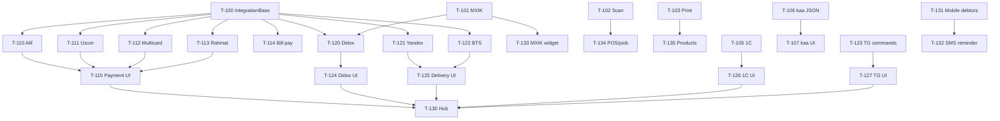

# SPEC-3: Sprint 4 — To'liq integratsiyalar to'plami

## Executive summary

Sprint 4 Aniq ERP'ga 16 ta yangi feature/integratsiya qo'shadi: to'lov provayderlari (Alif, Uzum, Multicard, Rahmat), biznes integratsiyalar (Didox e-faktura, Yandex Delivery, BTS Delivery, Telegram bot commands), real ishlaydi-gan frontend toollar (barcode scan/print, 1C export, MXIK katalog), mobile UX kengaytmasi (qarzdorlik card view, biometric auth) va beshinchi locale (Karakalpak). To'lov provayderlari va biznes integratsiyalar credentials olib kelinganda 1-2 kun ichida real ulanadigan scaffold sifatida yetkaziladi. Barcode, 1C export, MXIK, Karakalpak — hech qanday tashqi credentials talab qilmaydi va to'liq ishchi holda yetkaziladi. Sprint 44 ta sprint artifact (SPEC + ~25 ticket + DESIGN) va 4 wave ketma-ketlik bilan boshqariladi.

---

## Feature bo'yicha tafsilot

### F-1: IntegrationBase framework (backend)
**Nima:** `IntegrationBase` abstract class — JSONB settings, secret_box encrypt/decrypt, enabled toggle, `test_connection()` interface, per-org settings CRUD endpoint.
**Nima uchun:** Hamma yangi integratsiyalar (Alif, Uzum, Didox, Yandex, BTS, Multicard, Rahmat) bir xil pattern'da yozilishi uchun. Hozirda payments/base.py va telegram.py ikki xil pattern ishlatmoqda.
**Dependency:** Hech qaysi — bu asosiy poydevor.
**Tashqi API:** Yo'q.
**Taxminiy soat:** 4h.
**Done:** Barcha Wave 4B/4C scaffoldlari `IntegrationBase` dan meros oladi; test_connection() abstract method chaqirsa `NotImplementedError` qaytaradi.

---

### F-2: MXIK katalog (backend)
**Nima:** `mxik_products` jadval + Soliq.uz public CSV seed + `GET /reference/mxik/search?q=&limit=20` endpoint.
**Nima uchun:** Didox e-faktura MXIK kodi talab qiladi; mahsulot kartasida MXIK ni to'g'ri belgilash kerak.
**Dependency:** F-1 ga bog'liq emas, lekin F-3 (Didox) va F-15 (products widget) bu backend'ni kutadi.
**Tashqi API:** Yo'q (CSV manba — Soliq.uz public katalog, bir martalik import).
**Taxminiy soat:** 5h.
**Done:** `GET /reference/mxik/search?q=non` 200 qaytaradi, kamida 100 ta row seed qilingan.

---

### F-3: Barcode scan (frontend)
**Nima:** `components/barcode/scanner.tsx` — Web BarcodeDetector API (Chrome/Android), ZXing-js fallback.
**Nima uchun:** Ombor pick, mobile POS — qo'lda mahsulot qidirish o'rniga kamera.
**Dependency:** Hech qaysi.
**Tashqi API:** Yo'q (browser API + npm lib).
**Taxminiy soat:** 6h.
**Done:** Android Chrome'da real barcode ochilib, `onScan(code)` callback chaqiriladi.

---

### F-4: Barcode print (frontend)
**Nima:** `components/barcode/label-print.tsx` — JsBarcode + jsPDF, A4 / 58mm thermal preview va print.
**Nima uchun:** Mahsulot etiketkalari chop etish — hozir manual jarayon.
**Dependency:** Hech qaysi.
**Tashqi API:** Yo'q.
**Taxminiy soat:** 5h.
**Done:** Mahsulot sahifasida "Etiketka chop et" tugmasi PDF preview ochadi, `window.print()` ishlaydi.

---

### F-5: WebAuthn biometric auth (frontend)
**Nima:** `lib/biometric.ts` — WebAuthn `navigator.credentials.create/get`, mobile login sahifasida fingerprint/face id tugmasi.
**Nima uchun:** Mobile PWA'da tez kirish — password + passcode'ga qo'shimcha, ularni o'chirmasdan.
**Dependency:** Hech qaysi (mavjud auth flow'ni buzmaslik shart).
**Tashqi API:** Yo'q (browser WebAuthn API).
**Taxminiy soat:** 8h.
**Done:** Android Chrome'da biometric enrollment va login ishlaydi; boshqa qurilmada passcode orqali ishlaydi.

---

### F-6: 1C export (backend)
**Nima:** `GET /finance/export/1c-csv` va `GET /finance/export/1c-xml` — savdo, kassa harakatlari, kontragentlar eksport.
**Nima uchun:** Hisobchilar 1C'ga ma'lumot ko'chiradi — hozir qo'lda.
**Dependency:** Hech qaysi.
**Tashqi API:** Yo'q (offline format).
**Taxminiy soat:** 6h.
**Done:** `?date_from=&date_to=&format=csv` so'roviga 200 + correct Content-Disposition qaytadi.

---

### F-7: Karakalpak locale JSON (i18n)
**Nima:** `messages/kaa.json` — uz.json asosida tarjima, locale-provider'ga qo'shish.
**Nima uchun:** Qoraqalpog'iston foydalanuvchilari uchun.
**Dependency:** Hech qaysi.
**Tashqi API:** Yo'q.
**Taxminiy soat:** 3h (JSON + config).
**Done:** `/kaa` locale'da sahifa to'g'ri yuklanadi, switch ishlaydi.

---

### F-8: Karakalpak til tanlash UI (frontend)
**Nima:** Login va settings sahifalarida kaa til opsiyasi.
**Nima uchun:** F-7 backend'ini foydalanuvchiga ko'rsatish.
**Dependency:** F-7.
**Tashqi API:** Yo'q.
**Taxminiy soat:** 2h.
**Done:** Til ro'yxatida "Qaraqalpaqsha" ko'rinadi, tanlaganda sahifa kaa'da yuklanadi.

---

### F-9: Alif Bank scaffold (backend)
**Nima:** `IntegrationBase` dan meros `AlifService`, settings CRUD, to'lov initiation stub, webhook receiver stub.
**Nima uchun:** Alif Bank O'zbekistonda keng tarqalgan — kreditsiz to'lov.
**Dependency:** F-1 (IntegrationBase).
**Tashqi API:** Alif Bank merchant credentials (sandbox + prod). **Hozir yo'q — scaffold.**
**Taxminiy soat:** 4h.
**Done:** `POST /integrations/alif/test-connection` credentials bilan 200 qaytaradi; credentials yo'q bo'lsa 400.

---

### F-10: Uzum Bank scaffold (backend)
**Nima:** Xuddi F-9, `UzumService`.
**Dependency:** F-1.
**Tashqi API:** Uzum merchant credentials. **Hozir yo'q.**
**Taxminiy soat:** 4h.

---

### F-11: Multicard scaffold (backend)
**Nima:** `MulticardService`.
**Dependency:** F-1.
**Tashqi API:** Multicard API key. **Hozir yo'q.**
**Taxminiy soat:** 4h.

---

### F-12: Rahmat scaffold (backend)
**Nima:** `RahmatService`.
**Dependency:** F-1.
**Tashqi API:** Rahmat merchant credentials. **Hozir yo'q.**
**Taxminiy soat:** 4h.

---

### F-13: Bill/kommunal to'lov (backend)
**Nima:** Click API kengaytirish — `POST /finance/bill-payment` — hisob raqami bo'yicha kommunal to'lov.
**Nima uchun:** Kassirlar mijoz kommunal hisoblarini to'laydi.
**Dependency:** F-1; mavjud Click modul.
**Tashqi API:** Click Bill Payment API (mavjud Click credentials ishlatiladi).
**Taxminiy soat:** 5h.

---

### F-14: Payment settings UI kengaytirish (frontend)
**Nima:** `settings/online-payments/page.tsx` — 4 yangi provayder (Alif/Uzum/Multicard/Rahmat) toggle + config form + test tugma.
**Nima uchun:** F-9..F-12 backend scaffoldlarini boshqarish UI.
**Dependency:** F-9, F-10, F-11, F-12.
**Taxminiy soat:** 5h.

---

### F-15: Didox scaffold (backend)
**Nima:** `DidoxService` — e-faktura yaratish + yuborish stub, MXIK kod integratsiyasi.
**Dependency:** F-1, F-2 (MXIK).
**Tashqi API:** Didox API credentials (STIR + token). **Hozir yo'q.**
**Taxminiy soat:** 5h.

---

### F-16: Yandex Delivery scaffold (backend)
**Nima:** `YandexDeliveryService` — yuk yaratish + narx hisoblash stub.
**Dependency:** F-1.
**Tashqi API:** Yandex Delivery API key. **Hozir yo'q.**
**Taxminiy soat:** 4h.

---

### F-17: BTS Delivery scaffold (backend)
**Nima:** `BTSDeliveryService`.
**Dependency:** F-1.
**Tashqi API:** BTS Delivery API key. **Hozir yo'q.**
**Taxminiy soat:** 4h.

---

### F-18: Telegram bot command router (backend)
**Nima:** Mavjud webhook'ga command dispatch qo'shish — `/buyurtma`, `/qoldiq`, `/balans` stub handler'lar.
**Nima uchun:** Telegram orqali tez ma'lumot olish.
**Dependency:** Mavjud `telegram.py`.
**Tashqi API:** Mavjud bot token ishlatiladi.
**Taxminiy soat:** 5h.

---

### F-19: Didox settings UI (frontend)
**Nima:** `settings/didox/page.tsx` — STIR, token, test connection, invoice send preview.
**Dependency:** F-15.
**Taxminiy soat:** 3h.

---

### F-20: Delivery settings UI (frontend)
**Nima:** `settings/delivery/page.tsx` — Yandex + BTS birgalikda.
**Dependency:** F-16, F-17.
**Taxminiy soat:** 3h.

---

### F-21: 1C export UI (frontend)
**Nima:** `settings/1c-export/page.tsx` — sana filter + format tanlov + download tugma.
**Dependency:** F-6.
**Taxminiy soat:** 2h.

---

### F-22: Telegram bot commands UI (frontend)
**Nima:** `settings/crm/page.tsx` kengaytirish — bot commands ro'yxati, help matni.
**Dependency:** F-18.
**Taxminiy soat:** 2h.

---

### F-23: Integration hub (frontend)
**Nima:** `(dashboard)/integrations/page.tsx` — barcha integratsiyalar kartochkasi: status, enable/disable, tez o'tish.
**Dependency:** F-14, F-19, F-20, F-21, F-22.
**Taxminiy soat:** 5h.

---

### F-24: Mobile qarzdorlik card view (frontend)
**Nima:** `/m/finance/debtors/page.tsx` + `[id]/page.tsx` — mijoz qarzlar mobil ko'rinishi, tez qarz qo'shish/kamaytirish.
**Dependency:** Mavjud finance endpoints (customer-balance, turnover-report).
**Taxminiy soat:** 6h.

---

### F-25: SMS reminder (backend)
**Nima:** `POST /finance/debtors/{id}/send-sms` — qarz haqida SMS (Eskiz).
**Dependency:** Mavjud sms/eskiz.py; F-24 (UI chaqiradi).
**Taxminiy soat:** 3h.

---

### F-26: MXIK widget (frontend)
**Nima:** `products/page.tsx`'da MXIK qidiruv combobox — mahsulot kartasiga MXIK kod biriktirish.
**Dependency:** F-2.
**Taxminiy soat:** 4h.

---

### F-27: Barcode scan integration (frontend)
**Nima:** Mavjud mobile POS + warehouse pick sahifalariga `scanner.tsx` ni ulash.
**Dependency:** F-3.
**Taxminiy soat:** 3h.

---

### F-28: Barcode print integration (frontend)
**Nima:** `products/page.tsx` va product detail'ga `label-print.tsx` "Etiketka chop etish" tugma.
**Dependency:** F-4.
**Taxminiy soat:** 2h.

---

## Dependency graph (Mermaid)

---

## Wave sequencing

### Wave 4A — Foundation (2-3 kun, parallel)
Barcha feature'lar bir-biriga bog'liq emas, parallel bajariladi.

| Ticket | Feature | Owner |
|---|---|---|
| T-100 | IntegrationBase framework | backend-dev |
| T-101 | MXIK katalog + seed | backend-dev |
| T-102 | Barcode scan component | frontend-dev |
| T-103 | Barcode print component | frontend-dev |
| T-104 | WebAuthn biometric auth | frontend-dev |
| T-105 | 1C export endpoints | backend-dev |
| T-106 | Karakalpak locale JSON | frontend-dev |
| T-107 | Karakalpak UI | frontend-dev |

**Risk/gap Wave 4A:** WebAuthn server-side challenge storage kerak bo'lishi mumkin (Redis yoki DB). Architect qaror qilishi kerak.

---

### Wave 4B — Payment providers (2-3 kun, parallel, T-100 tugagandan keyin)

| Ticket | Feature | Owner |
|---|---|---|
| T-110 | Alif Bank scaffold | backend-dev |
| T-111 | Uzum Bank scaffold | backend-dev |
| T-112 | Multicard scaffold | backend-dev |
| T-113 | Rahmat scaffold | backend-dev |
| T-114 | Bill payment (Click ext.) | backend-dev |
| T-115 | Payment settings UI | frontend-dev |

**Risk/gap Wave 4B:** Hech bir provider credentials yo'q — test_connection() real API'ga ulanmaydi, mock response qaytaradi. Credentials kelganda backend-dev 1 ta kun ichida real ulanishni yozadi.

---

### Wave 4C — Business integrations (3-4 kun, parallel, T-100 + T-101 tugagandan keyin)

| Ticket | Feature | Owner |
|---|---|---|
| T-120 | Didox scaffold | backend-dev |
| T-121 | Yandex Delivery scaffold | backend-dev |
| T-122 | BTS Delivery scaffold | backend-dev |
| T-123 | Telegram bot commands | backend-dev |
| T-124 | Didox settings UI | frontend-dev |
| T-125 | Delivery settings UI | frontend-dev |
| T-126 | 1C export UI | frontend-dev |
| T-127 | Telegram UI kengaytirish | frontend-dev |

**Risk/gap Wave 4C:** Didox API documentation public emas — scaffold uchun yetarli, real ulanish uchun Didox developer portal'ga kirish kerak. Yandex Delivery sandbox credentials kerak.

---

### Wave 4D — Integration hub + mobile UX (2-3 kun, parallel, T-115 + T-124..T-127 tugagandan keyin)

| Ticket | Feature | Owner |
|---|---|---|
| T-130 | Integration hub sahifa | frontend-dev |
| T-131 | Mobile qarzdorlik card view | frontend-dev |
| T-132 | SMS reminder endpoint | backend-dev |
| T-133 | MXIK widget (products) | frontend-dev |
| T-134 | Barcode scan integration | frontend-dev |
| T-135 | Barcode print integration | frontend-dev |

**Risk/gap Wave 4D:** Integration hub barcha integratsiyalar statusini bir endpoint'dan olishi kerak (`GET /integrations/status`) — bu T-100'da belgilanishi kerak.

---

### Wave 4E — QA + polish (ixtiyoriy)

| Ticket | Feature | Owner |
|---|---|---|
| T-140 | QA review | qa-reviewer |
| T-141 | Fix batch | backend-dev + frontend-dev |
| T-142 | Rebuild + deploy | backend-dev |

---

## Out of scope (WON'T DO)

- **Soliq.uz integratsiyasi** — foydalanuvchi ixtiyoriy dedi, bu sprintda yo'q.
- **Real production Yandex/BTS/Didox/Alif/Uzum/Multicard/Rahmat API ulanishi** — credentials yo'q, scaffold yetarli.
- **Apelsin to'lov** — avvalgi sprintda "coming soon" qoldirilgan, bu sprintda ham yo'q.
- **Telegram bot yangi funksionalligi** — faqat command routing stub, bot state machine yo'q.
- **WebAuthn server-side passkey storage DB migration** — faqat browser-side enrollment (Wave 4A Risk'dan).
- **MXIK to'liq katalog sync** — bir martalik seed, avtomatik yangilanish yo'q.
- **Biometric auth uchun alohida backend endpoint** — existing JWT flow ishlatiladi.
- **1C real-time sync** — faqat manual download.

---

## Tashqi credentials kerak bo'lgan ro'yxat (foydalanuvchidan olish kerak)

| Integratsiya | Kerakli credentials |
|---|---|
| Alif Bank | Merchant ID, API key, sandbox URL |
| Uzum Bank | Client ID, Client Secret, sandbox URL |
| Multicard | API key, terminal ID |
| Rahmat | Merchant token, secret |
| Didox | STIR raqami, Didox developer token |
| Yandex Delivery | OAuth token, sender ID |
| BTS Delivery | API key, account ID |
| Telegram bot commands | (Mavjud bot token ishlatiladi — yangi credentials kerak emas) |

---

## Definition of Done (umumiy)

1. Scaffold ticket: `test_connection()` mock 200 qaytaradi; settings save/load ishlaydi.
2. Real ticket (barcode, 1C, MXIK, kaa): to'liq ishchi; manual smoke test o'tadi.
3. Frontend: 375/768/1280 responsive; `ConfirmDialog` ishlatilgan (window.confirm yo'q); `getErrorMessage` ishlatilgan.
4. Backend: `organization_id` filter mavjud; RBAC permission ro'yxatga qo'shilgan.
5. Menu elementi permission field bilan qo'shilgan.
6. QA reviewer blocker topmagan.
